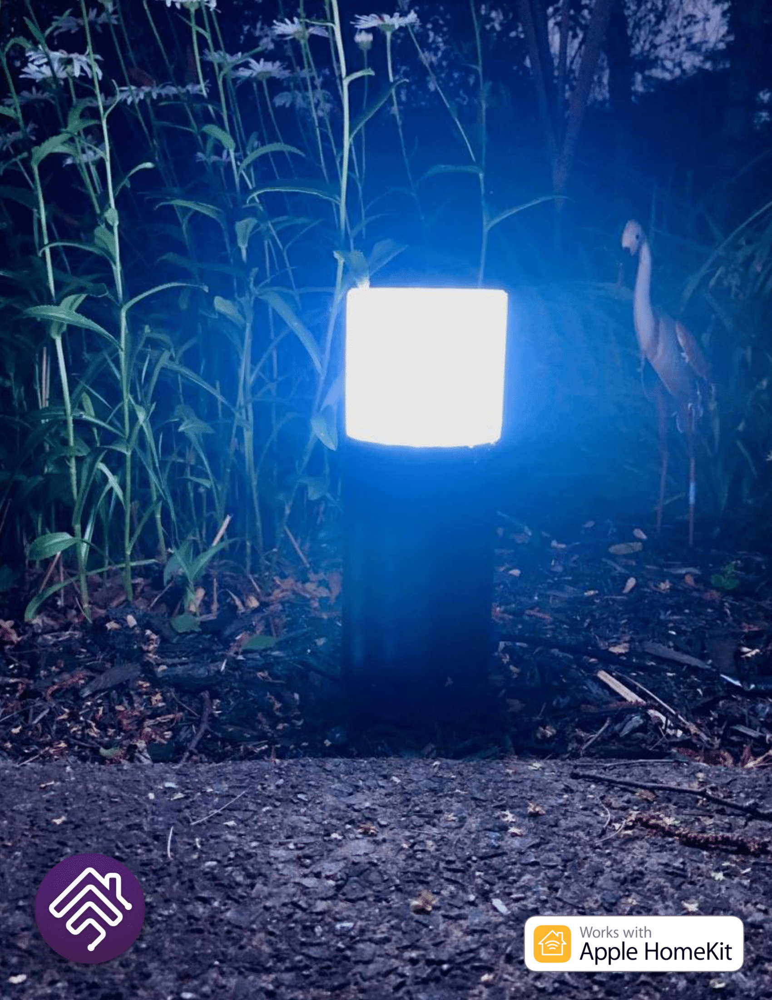
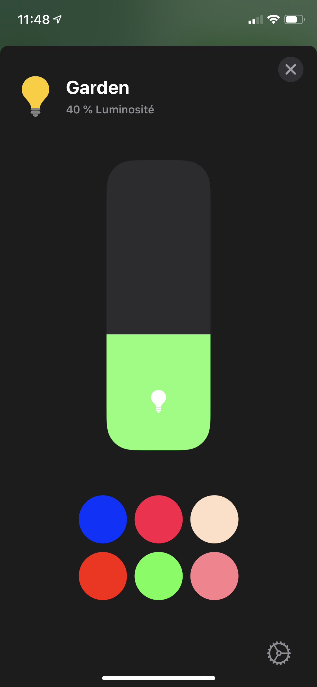

# Garden-Light with ESP8266 and Homebridge
> This projet able you to control led strip with an ESP8266 via Homebridge.


The projet explain how to use an ESP8266 and homebridge to control RGB strips using the plugin Better-RGB-Http
In my case, I use the leds to create garden lights.



## Installation on Raspberry

Before you install plugin make sure you have a raspberry running on the homebridge image.
You can find more details on how to burn the image to your raspberry on their website. https://github.com/homebridge/homebridge

Once your raspberry pi is ready, you want to install homebridge

```sh
sudo npm install -g --unsafe-perm homebridge
```
Next, install the plugin for the RGB leds.

```sh
npm install -g homebridge-better-http-rgb
```
Then you will need to change your config file. You will find the config file in /var/lib/homebridge/config.json.
Just use the cd command and open the file with nano command.
```sh
cd /var/lib/homebridge
sudo nano config.json
```
The file should look like this, unless you already add accesories. 
```sh
{
    "bridge": {
        "name": "Homebridge A28E",
        "username": "0E:71:2A:D6:A2:8E",
        "port": 51124,
        "pin": "642-04-069"
    },
     "accessories": [],
        "platforms": [
        {
            "name": "Config",
            "port": 8581,
            "platform": "config"
        }
    ]
}
```
To add a new RGB light accessory, you just add those lines of code right below the "bridge" section.
```sh
 "accessories": [
        {
            "accessory": "HTTP-RGB",
            "name": "RGB Strip",
            "service": "Light",
            "switch": {
                "status": "http://ESP8266's ip/status",
                "powerOn": "http://ESP8266's ip/on",
                "powerOff": "http://ESP8266's ip/off"
            },
            "color": {
                "status": "http://ESP8266's ip/color",
                "url": "http://ESP8266's ip/setC/%s"
            },
            "brightness": {
                "status": "http://ESP8266's ip/bright",
                "url": "http://ESP8266's ip/setB/%s"
            }
        }
 ]
```
We will later change the ESP8266's ip. For now you can save the file.

## Installation on ESP8266

Using the Arduino IDE, install the ESP8266 board manger, To do so, open the preference menu in file > Preference.
Beside the "Additional Boards Manager URLS" enter this URL : 
```sh
http://arduino.esp8266.com/stable/package_esp8266com_index.json
```
Then you go to Tools > Board > Boards Manager, next search for ESP8266. An option should appear. Install it.
Now you are good to go. 

> WiFi settings

Before uploading the code to the ESP8266, we need to change some codes in the WIFI section.
```sh
const char* ssid = "XXXXX";
const char* password = "YYYYY";
IPAddress ip(234, 124, 0, 32);   // set a fixed IP for the NodeMCU
IPAddress gateway(234, 124, 0, 1); // Your router IP
IPAddress subnet(255, 255, 255, 0); // Subnet mask
``` 

In order to connect the ESP8266 to internet, you need to replace the Xs and Ys with your router's id and password.
You also need to know the ip of your router. You can find that information on the configuration page of the router.
Next, you fix the ip address for your device. In the example it would be 234.124.0.32. If you don't fix a ip address to your device,
his address could if a black out occur and may cause some problem with homebridge. So with a fix address, the device will always be at the same address.

Next, you can upload the file to your ESP8266. Don't forget to change all the lines in the config file of homebrige with the ESP6266's ip address.
You wiil get errors if you don't change it. Once the change the file, save it and restart the server.

Now, if you open your home app you should see a new device name after the "name" property.
The device can be control as a normal homekit device.



## Release History

* 1.0.0
    * First release

## Meta

Thingiverse: https://www.thingiverse.com/dimensionprint/about

Instagram:  @dimension.3dprint


## Contributing

1. Fork it (https://github.com/Nicolas45Dev/Garden-Light_ESP8266andHomebridge)
2. Create your feature branch (`git checkout -b feature/featureName`)
3. Commit your changes (`git commit -am 'Add some featureName'`)
4. Push to the branch (`git push origin feature/featureName`)
5. Create a new Pull Request

<!-- Markdown link & img dfn's -->
## Reference
Original code for the ESP8266: https://www.studiopieters.nl/homebridge-rgb-light/ by Achim Pieters.

homebridge-better-rgb plugin: Justin J. Novack
